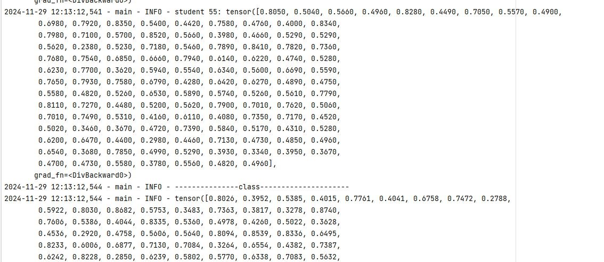

# 模型介绍

#### 一、模型运行

1.环境

Python==3.11.7

torch==2.4.1

Numpy==1.26.4

scipy==1.11.4

webencodings==0.5.1

docopt==0.6.2

2.运行

运行目录进入evaluation（cd evaluation），输入命令(python .\run.py sakt --hidden=<h> --length=<l> [options] )执行

例子：python .\run.py sakt --hidden=128 --length=200

**注：length的长度取决于数据集中学生问题序列长度，length需超过该长度**，若不满足要求则输出的知识掌握情况是有问题的

 3.更换数据集应进行的操作

3.1更换数据集，在dataset中放入新的数据集

3.2修改数据处理代码(dataloader.py)中的路径

绿色第一行为训练集存放位置，第二行为测试集存放位置，当更换数据集时需要修改

#### 二、模型输入

三行为一个单位，第一行为第二行的知识点数量（重复值也包括），第二行为题目对应的知识点，第三行为题目对应的正确与否，因为模型中的问题序列长度过高会导致运行速度较慢，故学生的问题序列不宜过长，建议200以内

例子：

 

**注：数据集中的知识点id应是连续的**

#### 三、模型输出

格式：一维向量，向量长度代表知识点数量（数据集中知识点数量），若数据集中知识点数量发生改变模型输出的一维向量长度也会改变，数值代表该知识点对应的知识掌握程度，向量中第一个值即为对知识点0的掌握情况，以此类推得到对每一个知识点的掌握情况。

例子：[0.8026, 0.3952, 0.5385, 0.4015, 0.7761, 0.4041, 0.6758, 0.7472, 0.2788,

​    0.5922, 0.8030, 0.8682, 0.5753, 0.3483, 0.7363, 0.3817, 0.3278, 0.8740,

​    0.7606, 0.5386, 0.4044, 0.8335, 0.5360, 0.4978, 0.4260, 0.5022, 0.3628,

​    0.4536, 0.2920, 0.4758, 0.5606, 0.5640, 0.8094, 0.8539, 0.8336, 0.6495,

​    0.8233, 0.6006, 0.6877, 0.7130, 0.7084, 0.3264, 0.6554, 0.4382, 0.7387,

​    0.6242, 0.8228, 0.2850, 0.6239, 0.5802, 0.5770, 0.6338, 0.7083, 0.5632,

​    0.7325, 0.7827, 0.7561, 0.6710, 0.4904, 0.7581, 0.4976, 0.4456, 0.2670,

​    0.6454, 0.5913, 0.2539, 0.5312, 0.7375, 0.6425, 0.6562, 0.3193, 0.7477,

​    0.7330, 0.7826, 0.2654, 0.5324, 0.4764, 0.7382, 0.6775, 0.5878, 0.4659,

​    0.7319, 0.7877, 0.4225, 0.1785, 0.7048, 0.4903, 0.8416, 0.8770, 0.4652,

​    0.7234, 0.2989, 0.2896, 0.2938, 0.6969, 0.7693, 0.4758, 0.4050, 0.5585,

​    0.7045, 0.6128, 0.5966, 0.1939, 0.3632, 0.7387, 0.3722, 0.3135, 0.3320,

​    0.7075, 0.2622, 0.8730, 0.3708, 0.2877, 0.5659, 0.1709, 0.3571, 0.2894,

​    0.5874, 0.3350, 0.5962, 0.3784, 0.3901, 0.3075, 0.2679]

#### 四、样例文件

模型输出的结果会放在log文件中，同一天的运行情况会放在同一个文件中

当前测试集中有55个学生，每一个学生对知识点的掌握情况同样也以一维向量形式呈现，数据前面会标有student i(eg:student 55)表明这是第55个学生的知识掌握情况，而class后的一维向量则是以这55个学生组成的班级的知识掌握情况。

